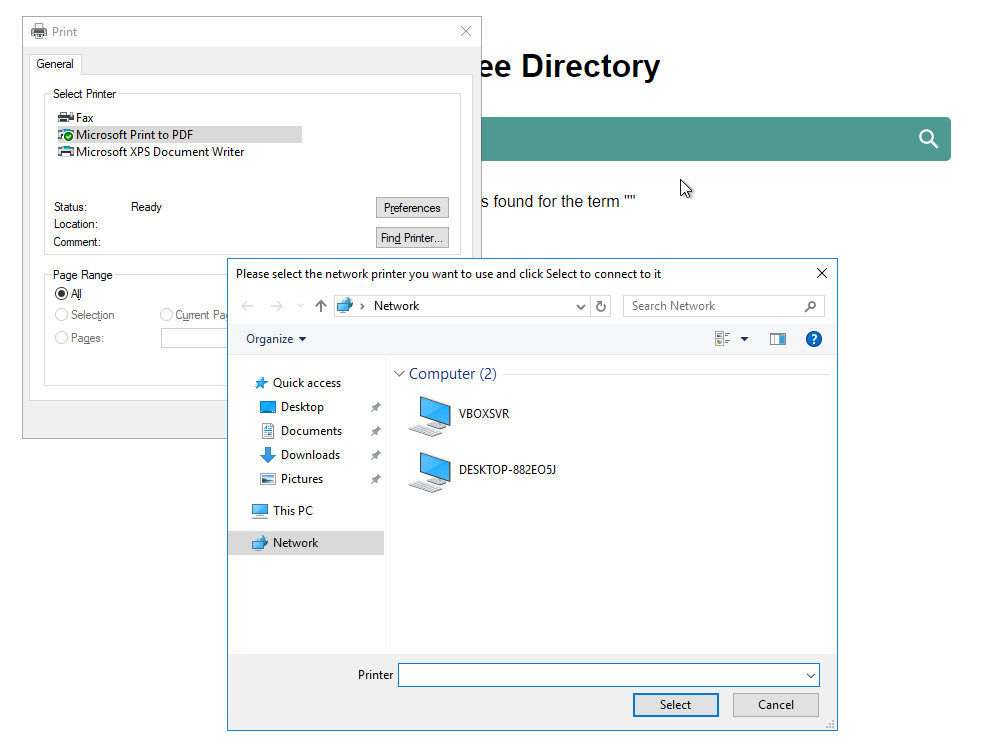

# CVE-2023-34641

## Description
KioWare for Windows through version 8.33 has an incomplete blacklist filter for blocked dialog boxes on Windows 10. This allows one to open a file dialog box via the javascript function "window.print()" in the KioWare browser and the "Find Printer" button. The resulting file dialog can then be used to open an unprivileged command prompt. This is only possible when the configuration allows for "Javascript Printing".

## Additional Information
This issue was discovered during KalmarCTF-2023 during the challenge "XScapy" where the goal was to discover CVE-2022-44875. During testing with default installation configuration options, I discovered this flaw.

[]

## Vulnerability Type
Sandbox escape / Incorrect Access Controls

## Vendor of Product
KioWare

## Affected Product Code Base
KioWare for Windows - through version 8.33

## Affected Component
KioWare Kiosk Browser

## Attack Type
Local

## Impact Code Execution
true

## Impact Escalation of Privileges
true

## Attack Vectors
Javascript execution in kiosk web browser leading to execution of unprivileged system commands

## Discoverer
Hunter Gregal, @huntergregal
